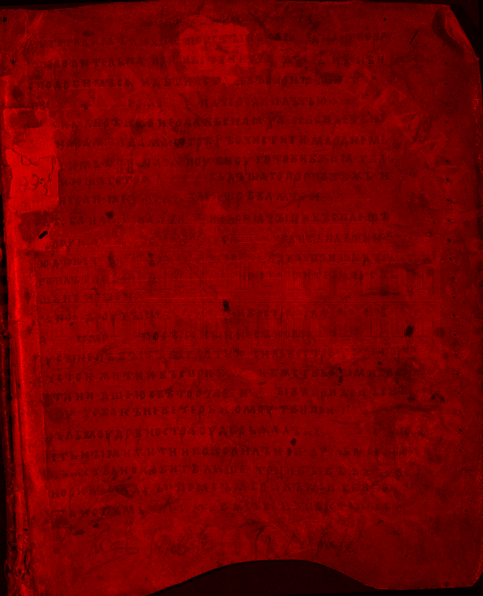
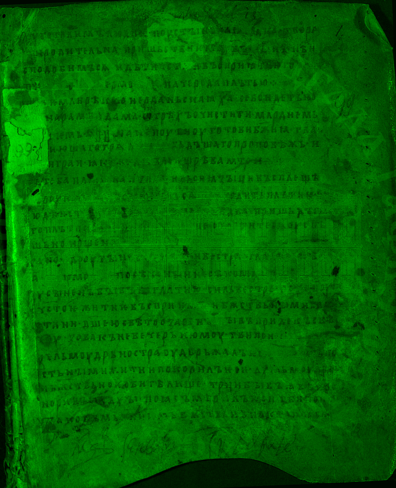
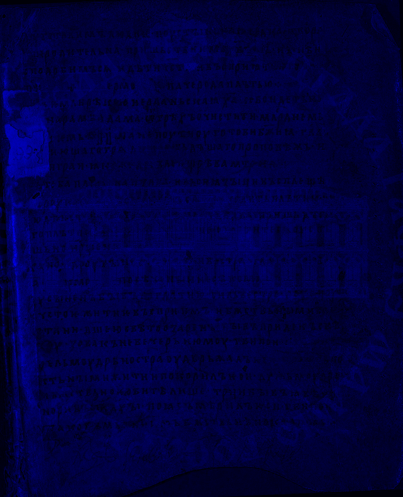
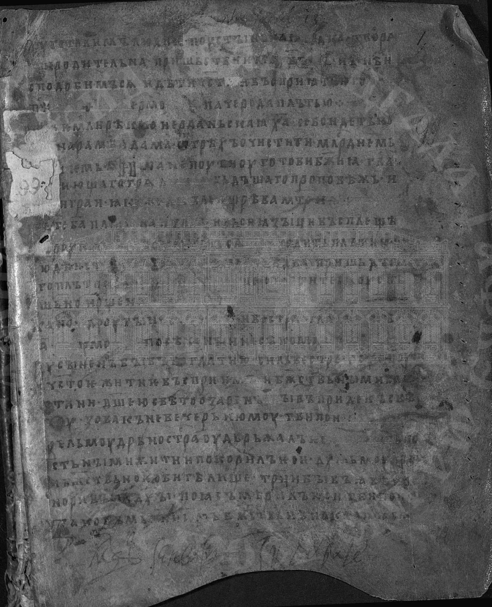
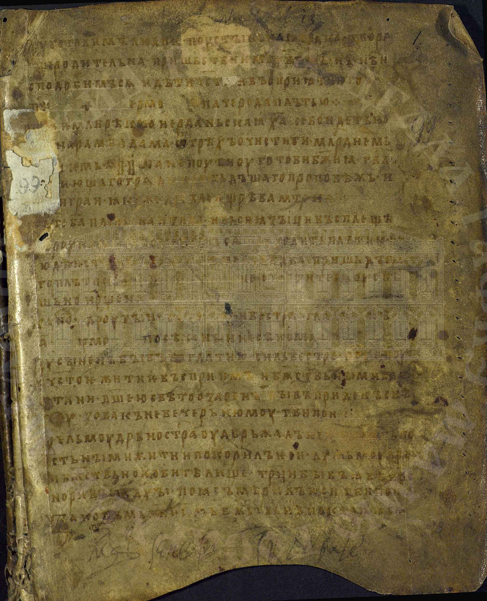

# Лабораторная работа №1
## Цветовые модели и передискретизация изображений

### Исходное изображение

### 1. Цветовые модели

#### 1.1 Компоненты R, G, B

|             Красный канал              |             Зеленый канал              |              Синий канал               |
|:--------------------------------------:|:--------------------------------------:|:--------------------------------------:|
|  |  |  |

#### 1.2 Яркостная компонента HSI

#### 1.3 Инвертирование яркостной компоненты

|            Исходное изображение            |                  С инвертированной яркостью                   |
|:------------------------------------------:|:-------------------------------------------------------------:|
|  |  |

### 2. Передискретизация (M=3, N=2, K=1.500)

#### 2.1 Растяжение в M раз (метод билинейной интерполяции)

|                  Исходное                  |                   Растянутое                   |
|:------------------------------------------:|:----------------------------------------------:|
|  |  |

#### 2.2 Сжатие в N раз (метод прореживания)

|                  Исходное                  |                    Сжатое                    |
|:------------------------------------------:|:--------------------------------------------:|
|  |  |

#### 2.3 Двухпроходная передискретизация (растяжение + сжатие)

|                  Исходное                  |             Результат двух проходов             |
|:------------------------------------------:|:-----------------------------------------------:|
|  |  |

#### 2.4 Однопроходная передискретизация (прямое масштабирование)

|                  Исходное                  |            Результат одного прохода             |
|:------------------------------------------:|:-----------------------------------------------:|
|  |  |

### Результаты выполнения

| Операция                          | Размер изображения |
|:----------------------------------|-------------------:|
| Исходное изображение              | 1877x2314 |
| Растяжение (M=3)                | 5631x6942 |
| Сжатие (N=2)                    | 939x1157 |
| Двухпроходная (M=3 + N=2)     | 2816x3471 |
| Однопроходная (K=1.500)         | 2816x3471 |

### Выводы

В ходе выполнения лабораторной работы были изучены:

1. **Цветовые модели RGB и HSI**:
   - Выделены компоненты красного, зеленого и синего каналов.
   - Выполнено преобразование RGB -> HSI.
   - Произведено инвертирование яркостной компоненты.

2. **Методы передискретизации**:
   - Реализован метод билинейной интерполяции для растяжения изображения.
   - Реализован метод прореживания для сжатия изображения.
   - Выполнена двухпроходная передискретизация: растяжение в M раз с последующим сжатием в N раз.
   - Реализована однопроходная передискретизация: прямое масштабирование в K=M/N раз.
