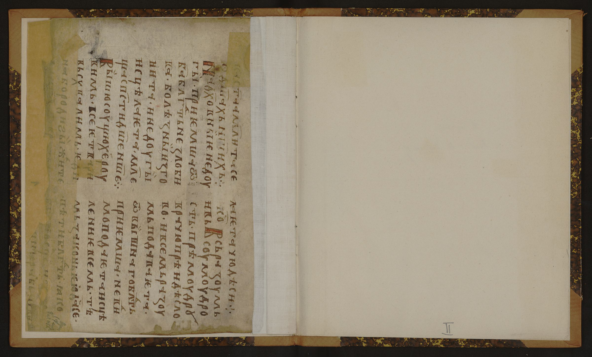
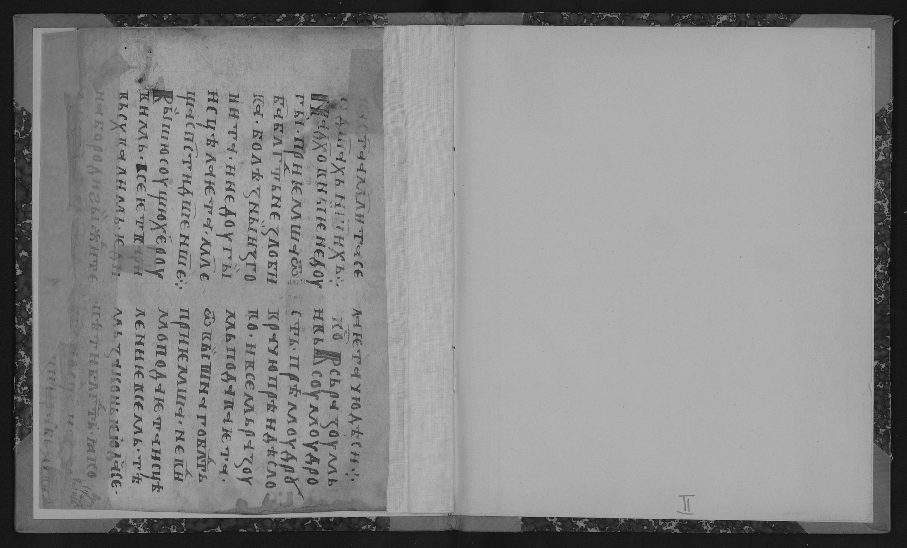
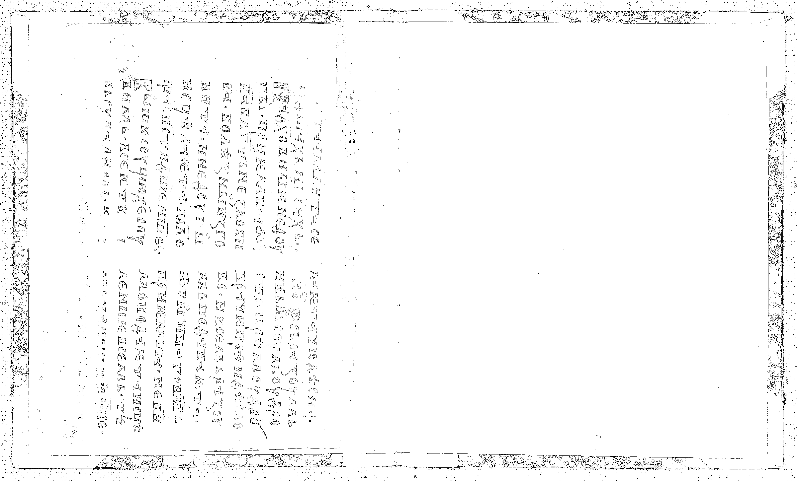
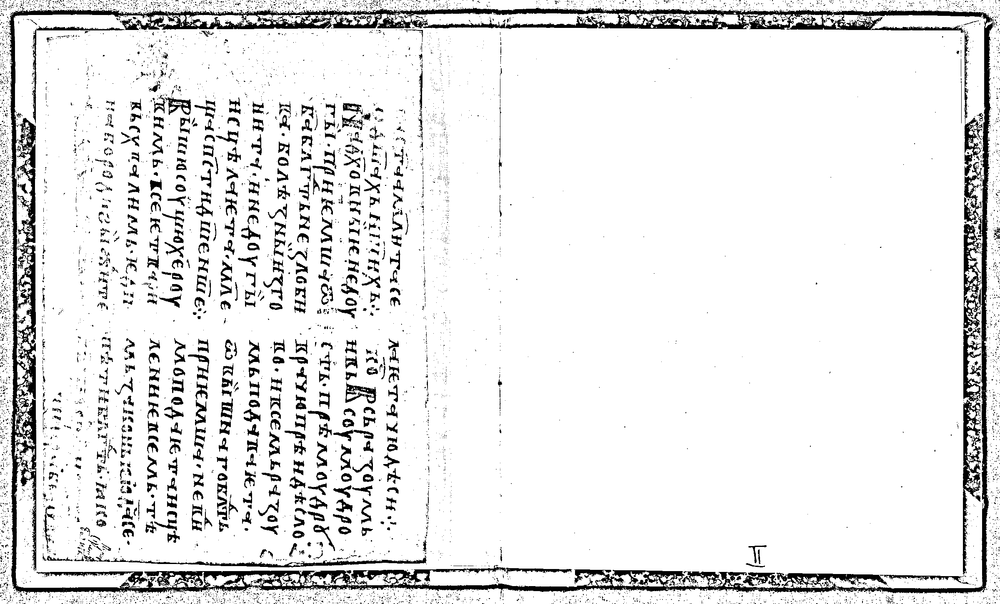

# Лабораторная работа №2
## Обесцвечивание и бинаризация растровых изображений

### Вариант 12: адаптивная бинаризация NICK
### Окна по обновленному PDF: 3x3, 25x25

### Исходные данные
- Количество изображений: 3
- Параметр метода NICK: `k=-0.1`
- Размеры окон NICK: `3x3, 25x25`
- Формат исходных локальных изображений: PNG (`src/img*_source.png`)
- Формат полутоновых и бинарных изображений: BMP

### Формулы

Обесцвечивание (взвешенное усреднение RGB):

```text
I(x, y) = 0.299 * R(x, y) + 0.587 * G(x, y) + 0.114 * B(x, y)
```

Адаптивный порог NICK:

```text
m(x, y)      = (1/|W|) * sum(I(i, j)),      (i, j) in W(x, y)
sqmean(x, y) = (1/|W|) * sum(I(i, j)^2),    (i, j) in W(x, y)
var(x, y)    = sqmean(x, y) - m(x, y)^2
T(x, y)      = m(x, y) + k * sqrt(var(x, y) + sqmean(x, y))
B(x, y)      = 255, если I(x, y) > T(x, y), иначе 0
```

### 1. Приведение полноцветного изображения к полутоновому

#### 1.1 Изображение 1
Источник: `https://www.slavcorpora.ru/images/122ebb37-36b4-42fb-b776-cae0b0800a43/image-0.jpeg`

| Исходное (RGB, PNG) | Полутоновое (BMP) |
|:-------------------:|:-----------------:|
|  |  |

#### 1.2 Изображение 2
Источник: `https://www.slavcorpora.ru/images/378b9a3c-3dde-4e9a-8408-ad6f094c1d36/image-0.jpeg`

| Исходное (RGB, PNG) | Полутоновое (BMP) |
|:-------------------:|:-----------------:|
|  |  |

#### 1.3 Изображение 3
Источник: `https://www.slavcorpora.ru/images/5b4264c5-f7b8-49d3-b19d-6f63b17e43fc/image-3.jpeg`

| Исходное (RGB, PNG) | Полутоновое (BMP) |
|:-------------------:|:-----------------:|
|  |  |

### 2. Бинаризация полутонового изображения методом NICK

#### 2.1 Изображение 1

| Полутоновое | NICK 3x3 | NICK 25x25 |
|:-----------:|:---------:|:---------:|
|  |  |  |

#### 2.2 Изображение 2

| Полутоновое | NICK 3x3 | NICK 25x25 |
|:-----------:|:---------:|:---------:|
|  |  |  |

#### 2.3 Изображение 3

| Полутоновое | NICK 3x3 | NICK 25x25 |
|:-----------:|:---------:|:---------:|
|  |  |  |

### Результаты выполнения

| Изображение | Размер | Бинарные файлы |
|:------------|-------:|:---------------|
| №1 (индекс 0) | 1877x2314 | `img1_binary_nick_w3.bmp, img1_binary_nick_w25.bmp` |
| №2 (индекс 5) | 3500x3770 | `img2_binary_nick_w3.bmp, img2_binary_nick_w25.bmp` |
| №3 (индекс 10) | 2400x1450 | `img3_binary_nick_w3.bmp, img3_binary_nick_w25.bmp` |

### Выводы

1. Реализовано обесцвечивание RGB-изображений без библиотечной функции перевода в grayscale.
2. Для варианта 12 реализована адаптивная бинаризация NICK с окнами 3x3 и 25x25 без библиотечных функций бинаризации.
3. В отчете показаны результаты каждой операции (до и после) на нескольких изображениях.
