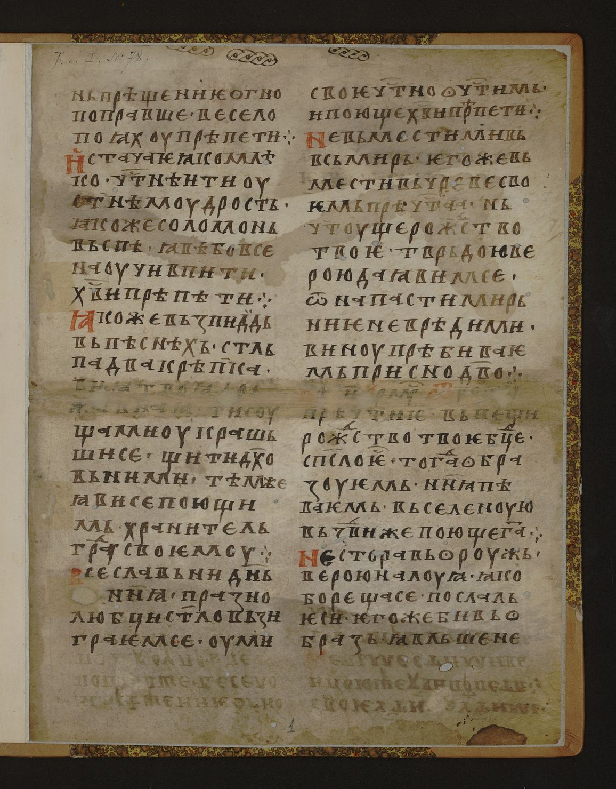
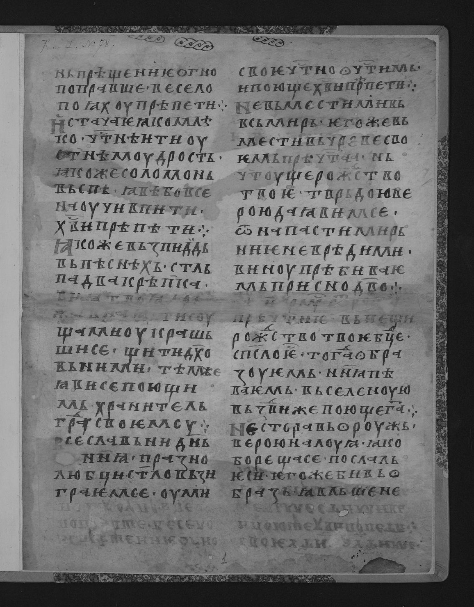
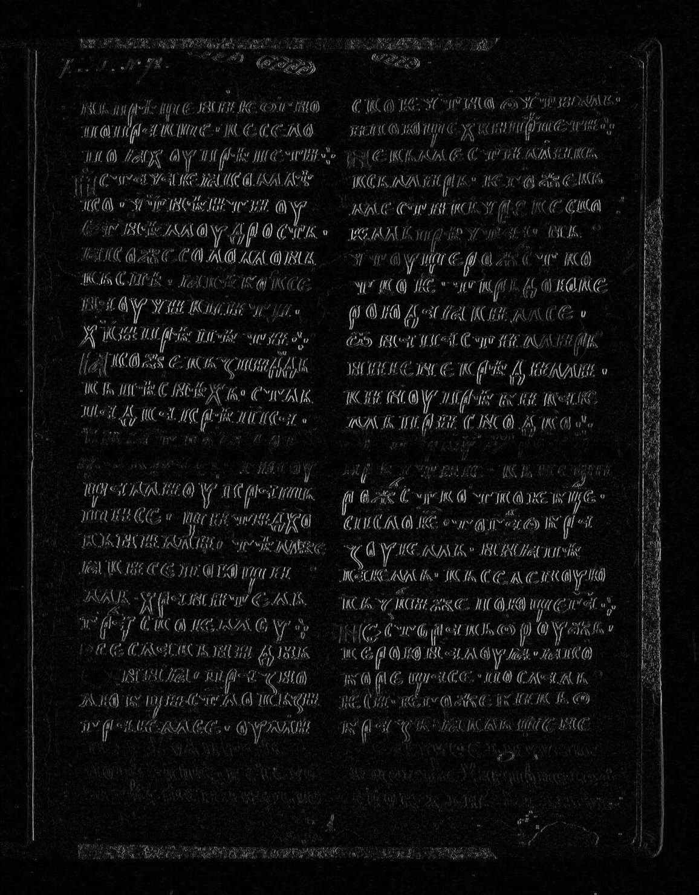
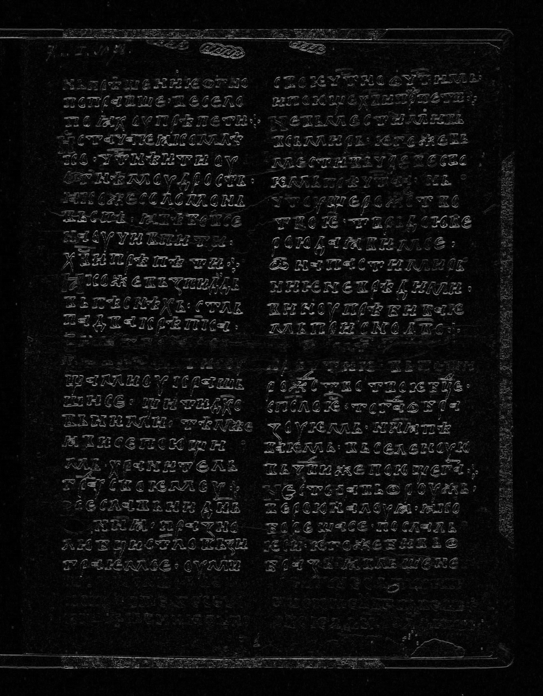
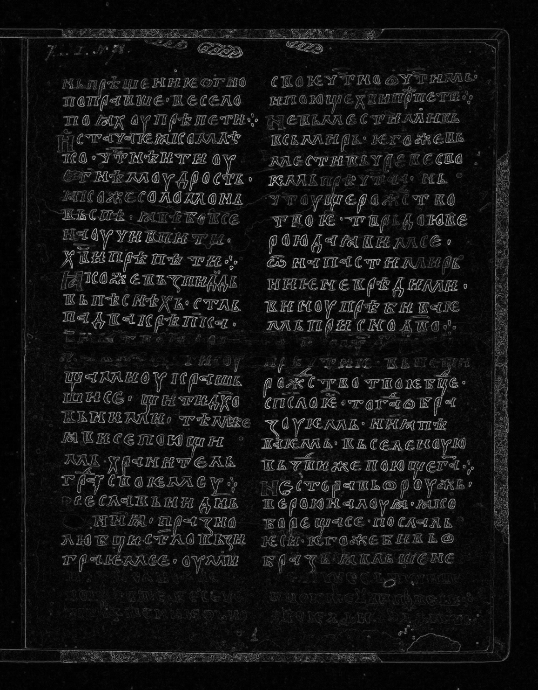
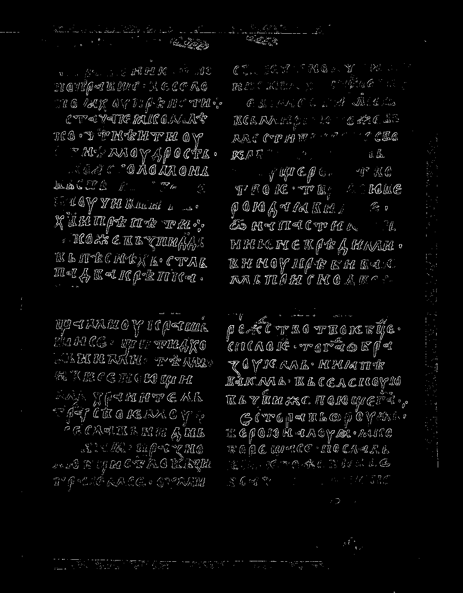

# Лабораторная работа №4
## Выделение контуров на изображении

### Вариант 12
- Оператор: Оператор Круна 3x3
- Формула градиента: `G = |Gx| + |Gy|`
- Порог бинаризации градиентной матрицы: `T=110` (подобран опытным путем)

### Исходные данные
- Источник: `https://www.slavcorpora.ru/images/29fd1f30-ef85-42da-bcca-133ca1839f51/image-2-2.jpeg`
- Размер изображения: `1156x1479`

### Формулы

Перевод цветного изображения в полутоновое:

```text
I(x, y) = 0.299 * R(x, y) + 0.587 * G(x, y) + 0.114 * B(x, y)
```

Градиенты по оператору Круна (ядра 3x3):

```text
Kx = [[ 17,   0, -17],
      [ 61,   0, -61],
      [ 17,   0, -17]]

Ky = [[ 17,  61,  17],
      [  0,   0,   0],
      [-17, -61, -17]]
```

```text
Gx = I * Kx
Gy = I * Ky
G  = |Gx| + |Gy|
```

Бинаризация градиентной матрицы:

```text
B(x, y) = 255, если G(x, y) >= T, иначе 0
```

### Результаты

#### 1. Исходное цветное изображение


#### 2. Полутоновое изображение


#### 3. Градиентные матрицы (нормализованные в диапазон 0..255)
| Gx | Gy | G |
|:--:|:--:|:--:|
|  |  |  |

#### 4. Бинаризованная градиентная матрица G


### Таблица файлов
| Операция | Файл |
|:---------|:-----|
| Исходное цветное | `src/source_color.png` |
| Полутоновое | `src/grayscale.bmp` |
| Нормализованная матрица Gx | `src/gx_norm.bmp` |
| Нормализованная матрица Gy | `src/gy_norm.bmp` |
| Нормализованная матрица G | `src/g_norm.bmp` |
| Бинаризация G | `src/g_binary.bmp` |

### Вывод
Для варианта 12 реализовано выделение контуров оператором Круна 3x3 с формулой `G = |Gx| + |Gy|`. Получены требуемые промежуточные матрицы `Gx`, `Gy`, `G` и итоговая бинаризованная карта контуров.
